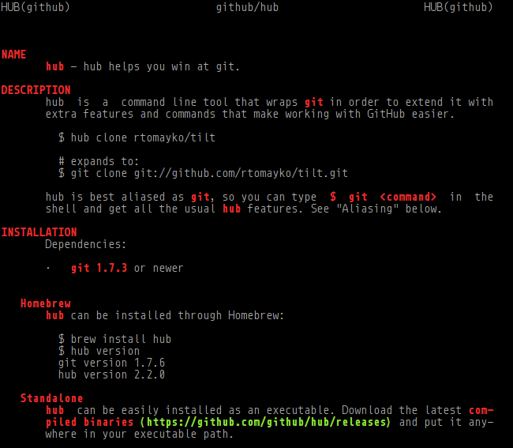

[](https://npmjs.com/package/github-man)

# github-man

[![Dependency Status][david-badge]][david]

Open README from GitHub repository as a man page.



[david]: https://david-dm.org/eush77/github-man
[david-badge]: https://david-dm.org/eush77/github-man.png

## CLI

### `github-man <user> <repo>`

Opens readme for `<user>/<repo>` as a man page.

## API

### `githubMan(user, repo, cb(err, man))`

Fetches readme for `<user>/<repo>` from GitHub and renders it into a man page.

## Related

- [npm-man] — open any package readme from npm as a man page.
- [readman] - display local package readme as a man page.

[npm-man]: https://github.com/eush77/npm-man
[readman]: https://github.com/eush77/readman

## Install

```
npm install -g github-man
```

## License

MIT
